class: center, middle
###Tidy Tusday Submission


```{r setup, include=FALSE}
options(htmltools.dir.version = FALSE)


```

???

Source credit: [Maggie Wanjiru](https://twitter.com/magwanjiru/status/1227327611409510400/photo/1)

---
# Dataset & TidyTuesday Selection


* There are 119390 observations and 32 variables. It captures data such as:

   + The hotel type (City hotel or a Resort hotel)
   
   + If the the booking was canceled
   
   + How many adults and children 

* Maggie Wanjiru the creator of this visual used a stacked bar chart to represent the data. She broke the data by year and by hotel type. She used gray to represent the percentage of bookings that were not canceled, while red represented canceled bookings.

---
# Critiques

##What are the good design choices?
* A stacked bar chart was a good choice to represent this data

    + It clearly visualizes the data as proportions of a whole
    
    + Works well for the visualization of many sets of proportions Separating the cancellations by type of hotel is beneficial to see if a particular hotel is doing better than the other
    
* There are labels for the x and y axis and a title above the visual

* It showcases cancellations for 3 years side-by-side

* The percentages of whether or not a booking was canceled is within each stacked bar

* There are no grid lines to clutter the information being presented

---
#Critiques cont.

##What are ways to improve the selected TidyTuesday entry?
* Include a legend to the side to showcase what the colors red and gray convey 

    + (instead of writing it underneath the title of the visual)
    
* Update the x-axis and y-axis labels to be more descriptive

* Increase the size of years above the stacked bar charts (it’s legible, however it would be less strain for viewers)

* Use a better color palette as the current choice is harsh on the eyes

---
# Modified Selection : Live Demo

Shiny Dashboard at https://abhijeetdtu.shinyapps.io/dsba5122/


---

class: center, middle
#Questions / Comments?
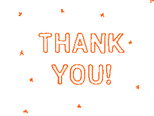
---
#Appendix - Shiny Dashboard Screenshots
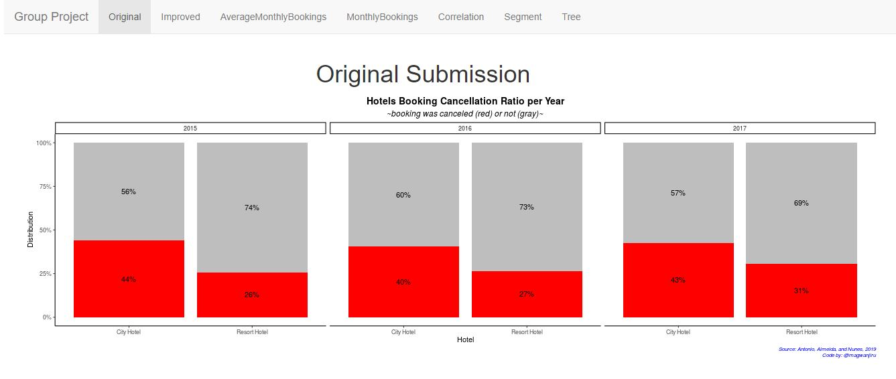

---
#Appendix - Shiny Dashboard Screenshots
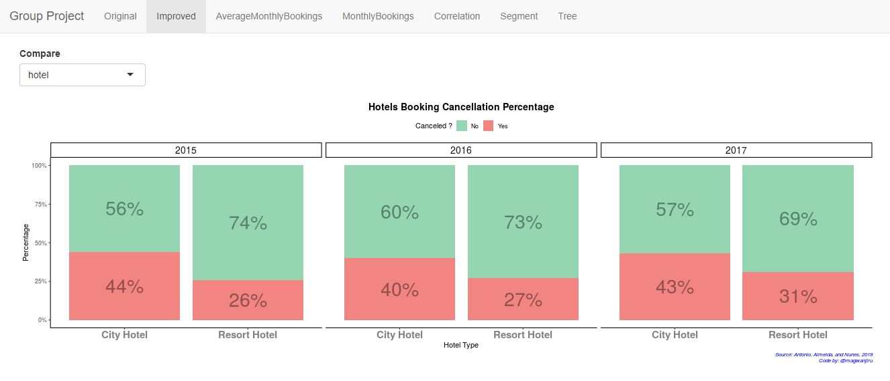

---
#Appendix - Shiny Dashboard Screenshots
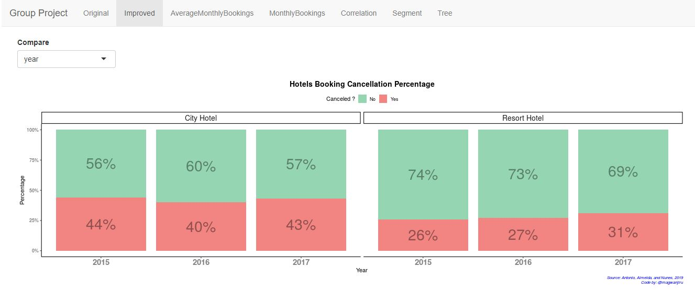

---
#Appendix - Shiny Dashboard Screenshots
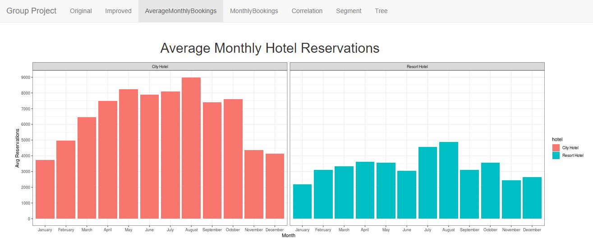

---
#Appendix - Shiny Dashboard Screenshots
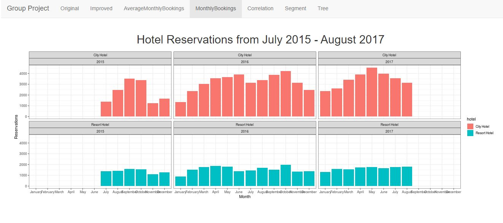

---
#Appendix - Shiny Dashboard Screenshots
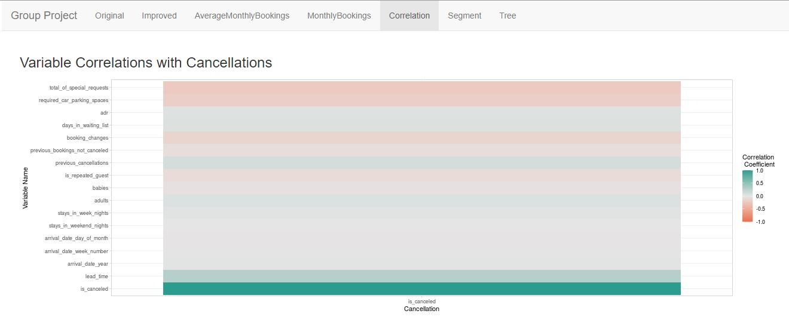

---
#Appendix - Shiny Dashboard Screenshots
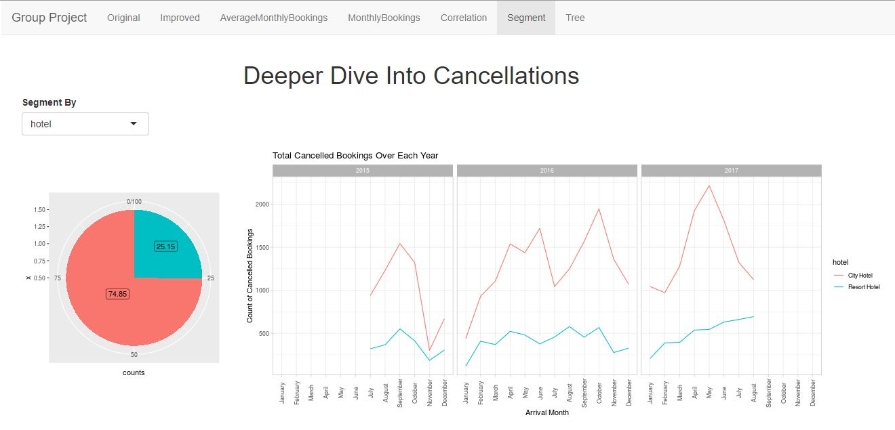

---
#Appendix - Shiny Dashboard Screenshots
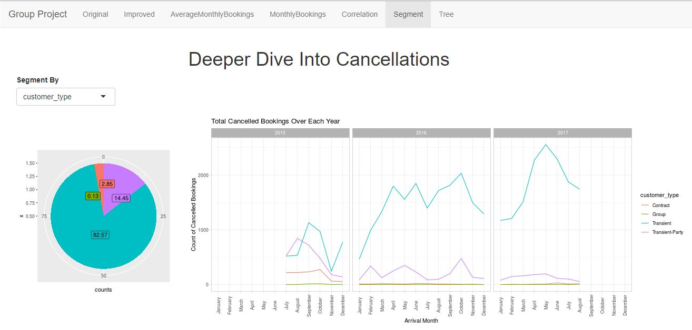

---
#Appendix - Shiny Dashboard Screenshots
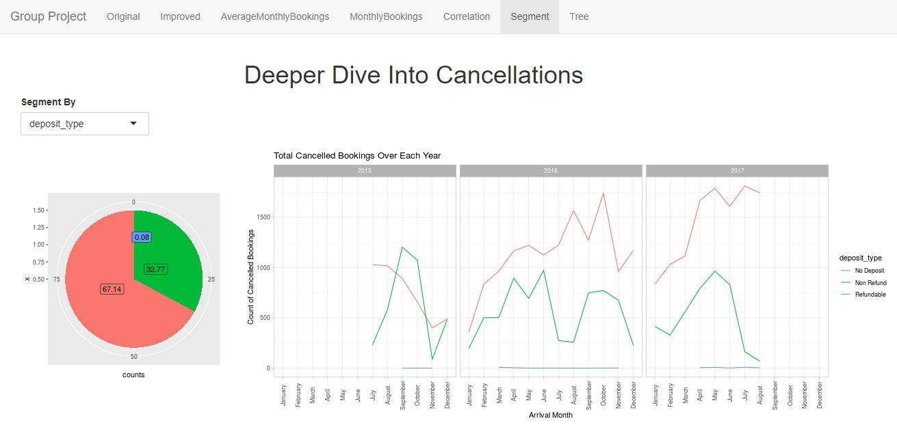

---
#Appendix - Shiny Dashboard Screenshots
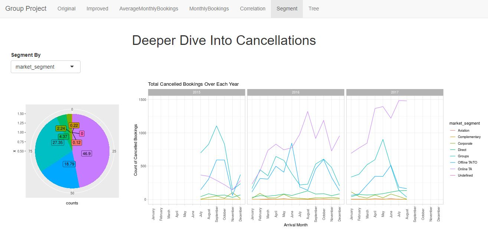

---
#Appendix - Shiny Dashboard Screenshots
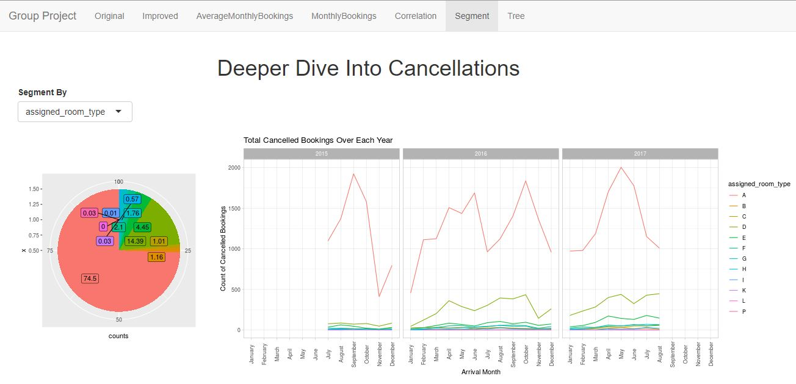

---
#Appendix - Shiny Dashboard Screenshots
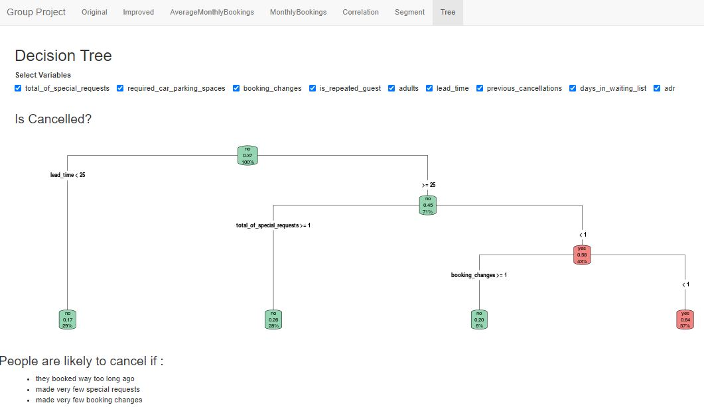

---
#Links and Resources

* Dataset available at https://bit.ly/3l6Lh4M <br/> 

* TidyTuesday available at https://bit.ly/3p2fNPz 

* Shiny Dashboard at https://abhijeetdtu.shinyapps.io/dsba5122/


